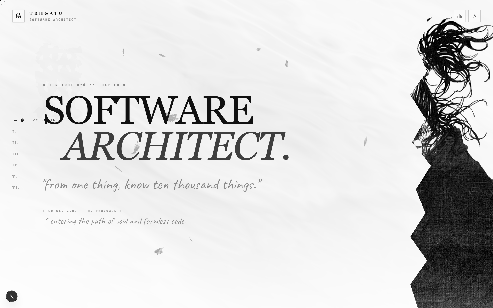
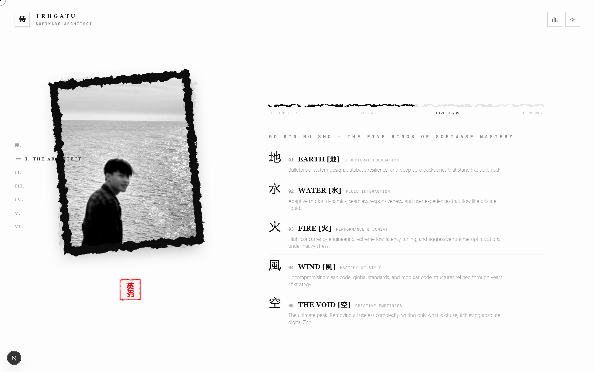
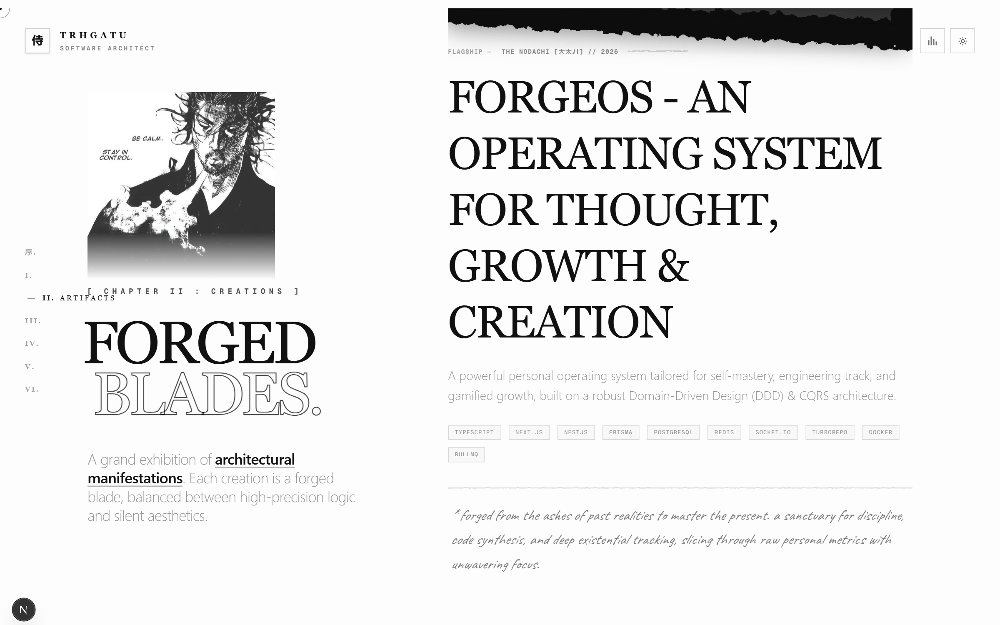
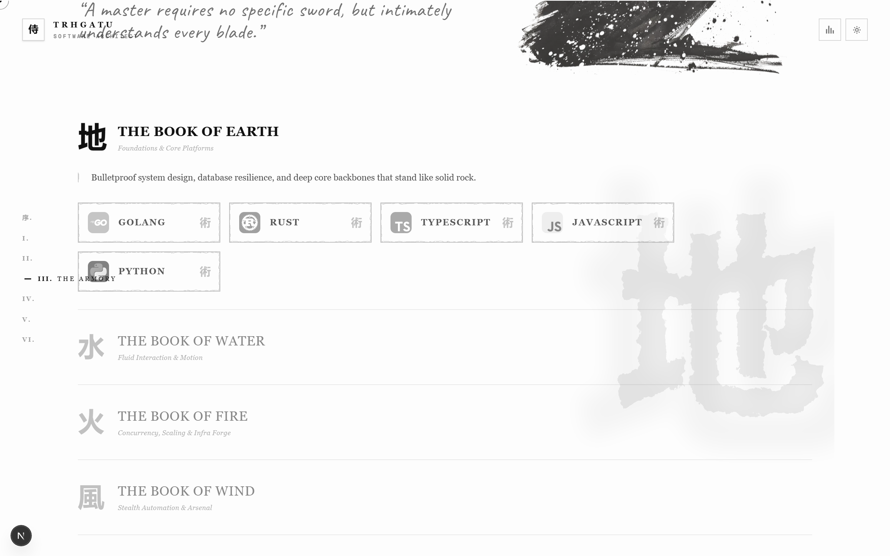
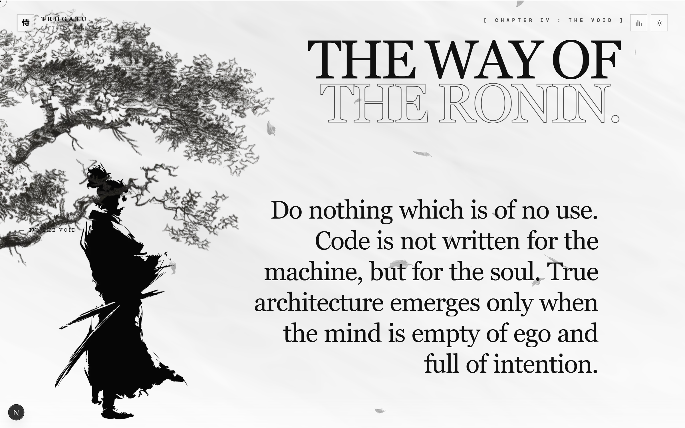
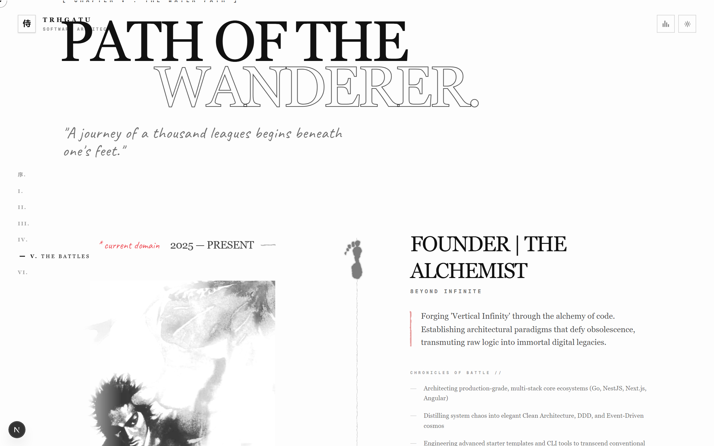
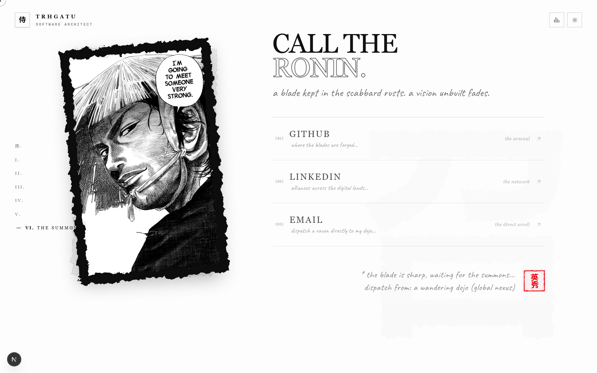

# 侍 the ronin architect

A personal portfolio built as a samurai-themed visual novel — every section is a "chapter," scroll is the page-turn, and the whole thing leans on ink-brush textures, torn-paper edges, and kanji calligraphy instead of generic SaaS-portfolio patterns.

**Live:** [thatu.dev](https://thatu.dev)



## Chapters

### Chapter 0 — Hero
Full-bleed sumi-e ink illustration, an OGL/WebGL wind-particle backdrop, and a title reveal — the "prologue" before the site properly begins.

### Chapter I — The Architect (About)
A four-act pinned stage (`position: sticky`, not a GSAP pin — see [note below](#notes-on-the-build)) that scroll-drives through an intro, an origin story, a Five Rings colophon, and a closing philosophy quote. The portrait frame morphs its pose per act, and a giant backdrop kanji cycles as a mood clock.



### Chapter II — Creations (Artifacts)
Projects framed as forged blades — a flagship case study up top (full-width, its own layout), then three more in an alternating rhythm below, each with a divider line sized to that blade's *actual* historical length (nodachi longest, tanto shortest). The chapter header stays sticky beside the list as it scrolls past.



### Chapter III — The Armory (Stack)
Tech stack as an accordion of "books" (Earth / Water / Fire / Wind), each opening onto a shelf of skill cards. A two-plane ambient kanji crossfades to whichever book is open.



### Chapter IV — The Void (Philosophy)
A single manifesto quote, ink-revealed character by character, layered over a parallaxing sumi-e tree and a WebGL fluid shader.



### Chapter V — The Water Path (Experience)
A zigzag timeline of roles, ink-stamped footprints marking each entry as it scrolls into view, with the current role's stack organized into the same Five-Rings tabbed browser.



### Chapter VI — The Summons (Contact)
A manga double-page spread — a hover-morphing portrait panel on one side, three outbound links (GitHub, LinkedIn, email) on the other.



## Stack

- **[Next.js 16](https://nextjs.org)** (App Router) · **React 19** · **TypeScript**
- **[GSAP](https://gsap.com)** + `ScrollTrigger` for scroll-driven staging, and **[Framer Motion](https://www.framer.com/motion/)** for interactive UI state
- **[Lenis](https://github.com/darkroomengineering/lenis)** for smooth scroll, wired into GSAP's ticker so `ScrollTrigger` stays in sync with both wheel input and programmatic scrolls
- **[Three.js](https://threejs.org)** / `@react-three/fiber` / **[OGL](https://github.com/oframe/ogl)** for the WebGL backdrops
- **Tailwind CSS v4**
- Hand-rolled SVG `feTurbulence` filters throughout for the torn-paper / ink-bleed textures — no image assets for those

## Getting started

```bash
npm install
npm run dev
```

Open [http://localhost:3000](http://localhost:3000).

```bash
npm run build   # production build
npm run lint    # eslint
```

## Notes on the build

A few decisions worth knowing if you're reading the source:

- **Sticky over pin.** Every "locked in place while content changes" moment (About's stage, Artifacts' header) uses CSS `position: sticky`, not GSAP's `pin`. A site-wide per-section reveal animation leaves a resting `transform` on every `<section>`, which — combined with `pin`'s use of `position: fixed` — breaks per the CSS spec's containing-block rules. `sticky` sidesteps it entirely, with the one caveat that no ancestor of a sticky element can have `overflow` other than `visible`.
- **One scroll axis.** Nothing on the page ties vertical scroll to a second, hidden axis (no scroll-driven horizontal carousels). Earlier iterations tried that for the Five Rings widget; it read as confusing rather than clever, so it's now a plain always-visible list instead.
- **Lenis ↔ GSAP sync.** Lenis drives scroll from its own RAF loop, which doesn't always forward as native scroll events — `ScrollTrigger` (which listens for those) can silently stop updating for anything scrolled programmatically. `SmoothScroll.tsx` forwards Lenis's own scroll events to `ScrollTrigger.update` to close that gap.
