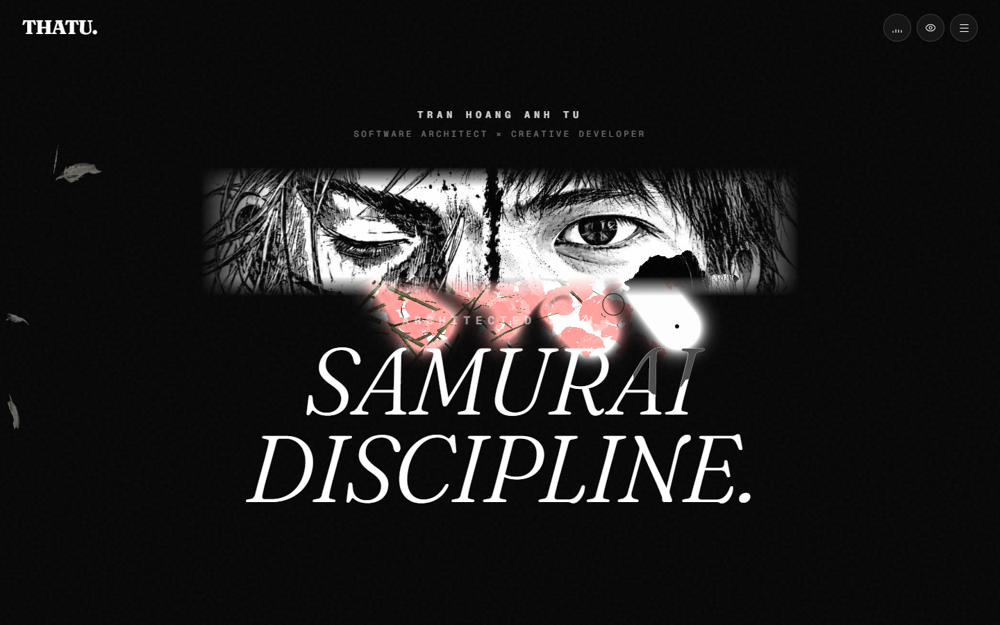
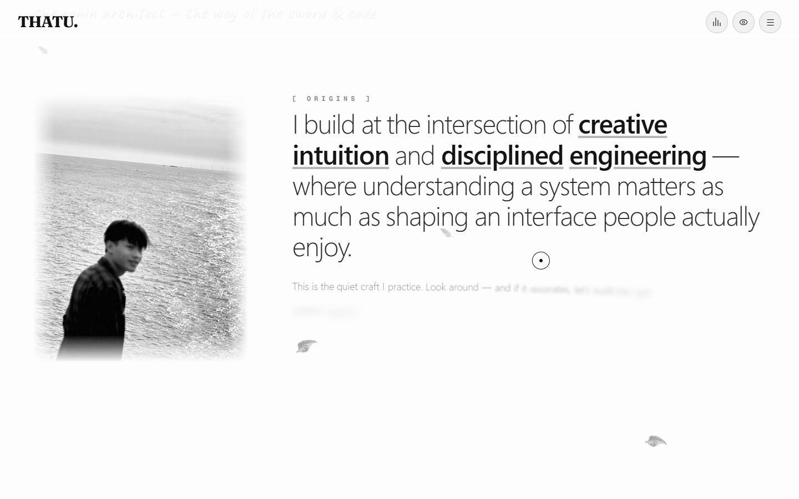
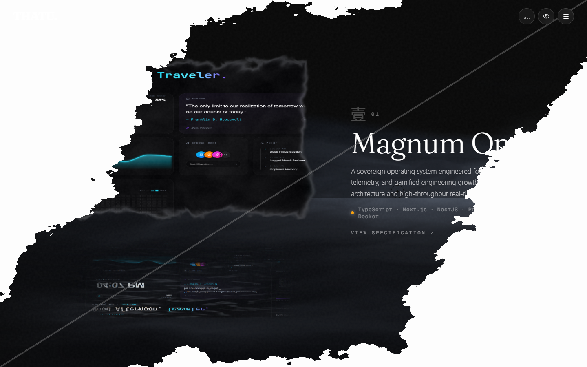
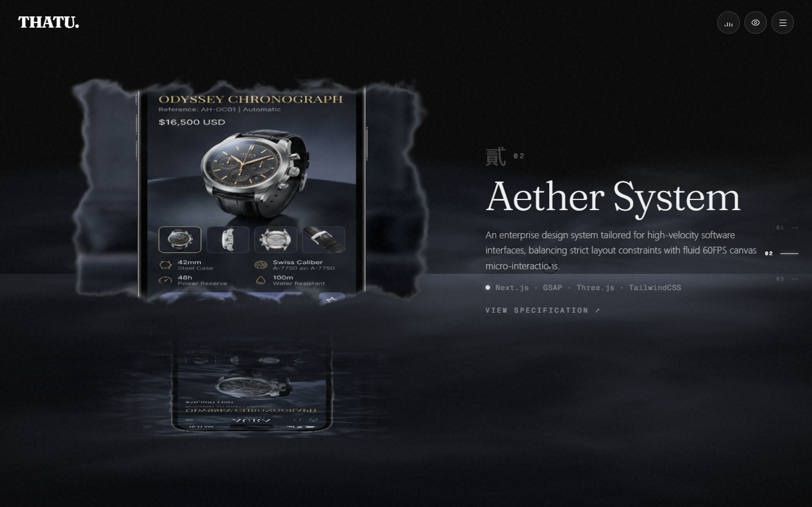
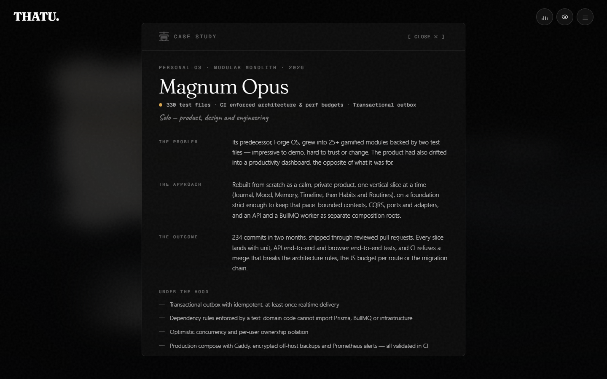
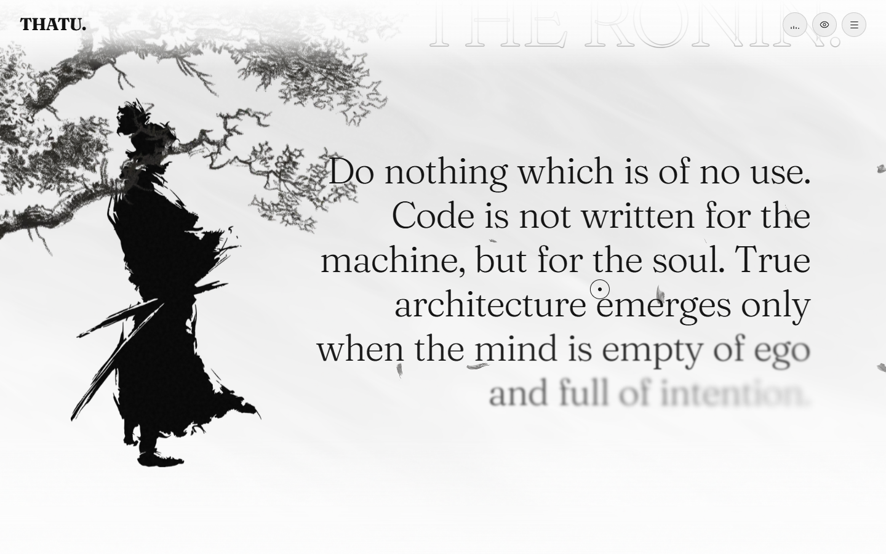
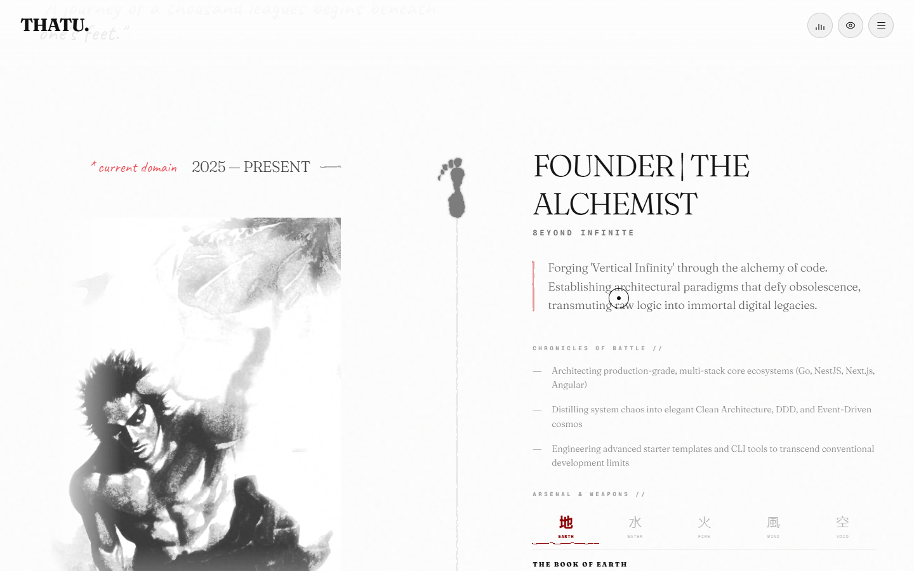
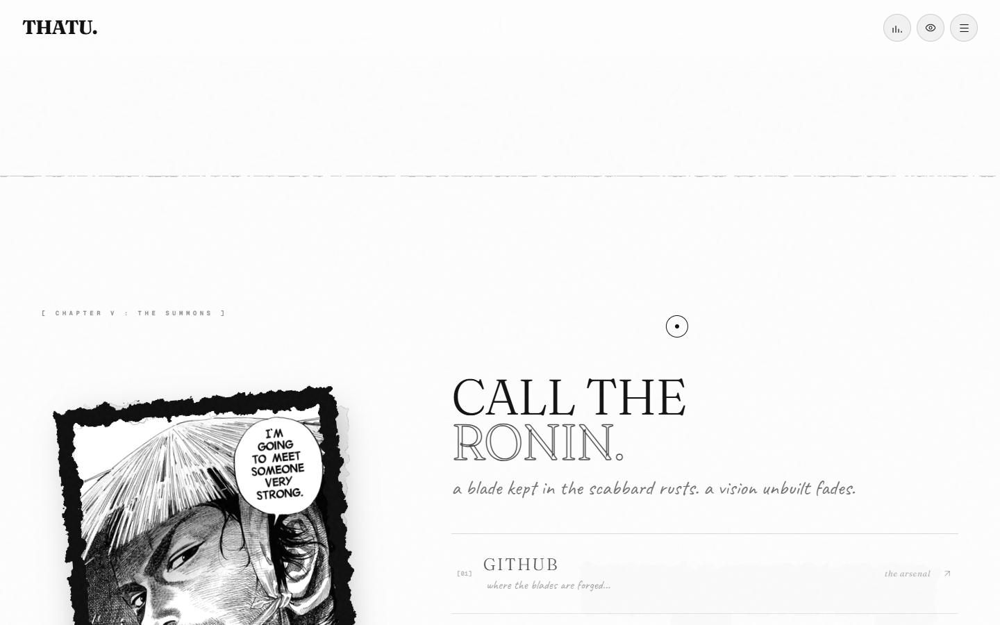

# 侍 the ronin architect

A personal portfolio built as a samurai-themed visual novel. Every section is a "chapter", scrolling turns the page, and the whole thing leans on sumi-e ink, torn washi paper and kanji instead of generic SaaS-portfolio patterns.

**Live:** [thatu.dev](https://thatu.dev)



## Chapters

### Prologue — Hero
The Musashi × Tu crest and the "Architected with Samurai Discipline" title card sit on a WebGL fluid-ink veil. Moving the cursor stirs the ink and reveals the 3D scene behind it (a samurai resting under a pink-leafed tree). A torn-paper hole follows the cursor and inverts the text and crest underneath it. The eye button in the header swaps to an unveiled parchment mode with a water-ripple pass over the 3D scene.

### Chapter I — The Ronin Architect (About)
Hero's black bleeds into the paper through a ragged ink edge. The name headline reveals word by word. A portrait and the origin statement follow, under a continuous rain of ink leaves.



### Chapter II — Artifacts
A 560vh sticky stage driven by a single `ScrollTrigger`:
1. "Where thought becomes form." A katana slash then tears the white paper open (OGL shader) onto a dark forge.
2. Four projects on a night lake: Magnum Opus, Auto WP Publisher, The Alchemist and Kim Khanh. Each shows through a mist-edged portal that morphs between projects, with a live water reflection underneath. A katana rail jumps between projects. Clicking the portal (or "View case study") grows the image straight out of its mist frame into the case study page, with the problem, approach, outcome and engineering notes beside it. Each case study has its own `?project=` URL, and Back closes it. Project data lives in `PROJECTS` in `src/features/portfolio/Artifacts.tsx`, and the stage stretches to fit however many there are.
3. A white washi mist rolls in and hands over to the next chapter.





### Chapter III — The Void (Philosophy)
A single manifesto quote, ink-revealed character by character. It sits over a parallaxing sumi-e tree, a Musashi silhouette and a WebGL fog shader.



### Chapter IV — The Water Path (Experience)
A zigzag timeline with ink footprints stamped in as each entry scrolls into view. The current role's stack is organized into Five Rings tabs (地 水 火 風 空).



### Chapter V — The Summons (Contact)
A manga panel that swaps expression when a link is hovered, three outbound links (GitHub, LinkedIn, email) and a hanko seal that stamps on hover.



The site opens on an ensō preloader. Its "Enter the Void" button is also the user gesture that unlocks audio: background music plus procedural Web Audio sword, footstep and stamp effects. Sound starts muted and has a toggle in the header.

## Stack

- **[Next.js 16](https://nextjs.org)** (App Router) · **React 19** · **TypeScript**
- **[GSAP](https://gsap.com)** + `ScrollTrigger` for scroll-driven staging. **[Framer Motion](https://motion.dev)** for the menu overlay and preloader.
- **[Lenis](https://github.com/darkroomengineering/lenis)** for smooth scroll, with its scroll events forwarded to `ScrollTrigger` (see `src/components/ui/SmoothScroll.tsx`).
- **[Three.js](https://threejs.org)** / `@react-three/fiber` / `drei` for the 3D Hero scene. **[OGL](https://github.com/oframe/ogl)** and raw WebGL for the full-screen shaders (fluid veil, paper tear, lake, mist portal, fog, ink transitions).
- **Tailwind CSS v4** (theme tokens in `src/app/globals.css`, no config file).
- Hand-rolled SVG `feTurbulence` filters for the torn-paper and ink-bleed textures.

## Getting started

```bash
pnpm install
pnpm dev
```

Open [http://localhost:3000](http://localhost:3000).

```bash
pnpm build   # production build
pnpm start   # serve the production build
pnpm lint    # eslint
```

## Project layout

```
src/
  app/                  layout (fonts, metadata, global layers), page, globals.css
  features/portfolio/   one component per chapter (Hero, About, Artifacts, …); content lives inline
  components/shared/    Navbar, Footer, Preloader, cursor, and every WebGL piece
  components/ui/        SmoothScroll (Lenis root)
  hooks/                useTornCursorMask
  lib/                  gsap setup, sound manager, visibility (offscreen pause)
```

## Notes on the build

- **Sticky over pin.** Every "locked in place while content changes" moment uses CSS `position: sticky`, not GSAP's `pin`. Sections carry resting transforms from their reveal animations, and `pin`'s `position: fixed` breaks inside a transformed ancestor. `sticky` sidesteps that, with one caveat: no ancestor of a sticky element can have `overflow` other than `visible`.
- **Cross-component signals are window events.** Pieces that live in separate trees (layout-level canvases and header vs. page sections) talk through `CustomEvent`s:
  - `preloader-complete`
  - `trigger-ink-transition`
  - `hero-swap-mode` / `request-hero-swap-toggle`
  - `dark-section` (a section tells the header it is over a dark background)
  - `sound-mute-toggle`
- **Nothing renders offscreen.** The 3D Hero canvas is fixed behind the whole page, but only Hero ever shows it, so its frameloop stops once Hero leaves the viewport. Every other rAF/WebGL loop and every infinite leaf tween pauses the same way, through `watchVisibility()` in `src/lib/visibility.ts`. Textures are uploaded at load, so resuming a loop doesn't hitch mid-scroll.
- **The case study opens without a delay.** `ProjectMistPortal` draws into a canvas that covers the whole Artifacts stage and only shades a quad around the portal's current rect. Opening a case study just animates that rect from the mist frame to the case study's hero slot, and the torn mist edge grows with it. The image is already a texture on the GPU, so nothing is loaded, resized or re-uploaded on click.
- **Lenis ↔ GSAP sync.** Lenis drives scroll from its own rAF loop, so `ScrollTrigger` can miss programmatic scrolls unless Lenis's scroll events are forwarded to `ScrollTrigger.update`.
